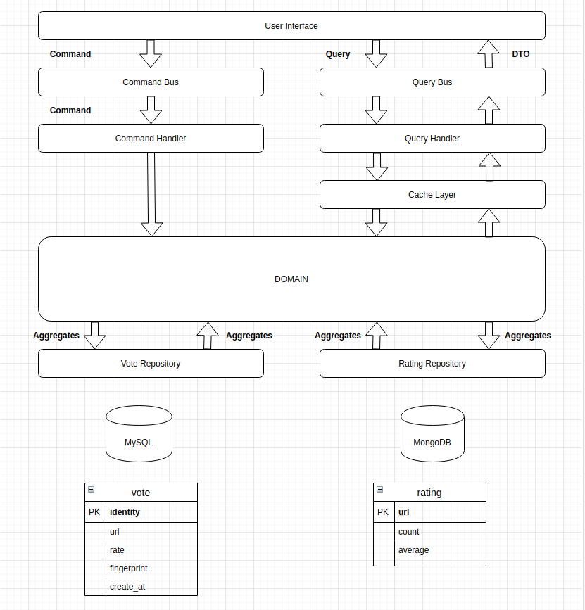

# RateBtn API
A zero-configuration rate button for website

### Website
[ratebtn.ttarnawski.usermd.net](http://www.ratebtn.ttarnawski.usermd.net/)

### Documentation
[api.ratebtn.ttarnawski.usermd.net/specification](https://petstore.swagger.io/?url=https://api.ratebtn.ttarnawski.usermd.net/specification)

### CQRS architecture, Command & Command Handler Pattern



### Getting started
In order to set application up you must follow by steps:

1. Go to project directory:
```bash
cd ratebtn-api
```
2. Build Docker images:
```bash
docker-compose build
```
3. Start Docker container:
```bash
docker-compose up -d
```

